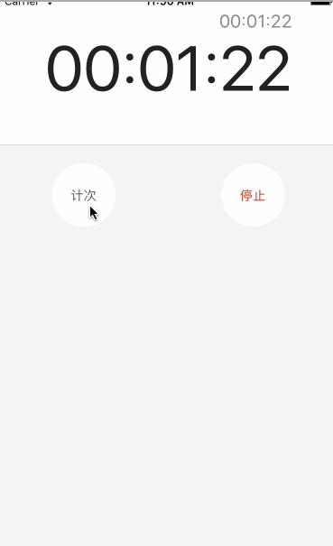
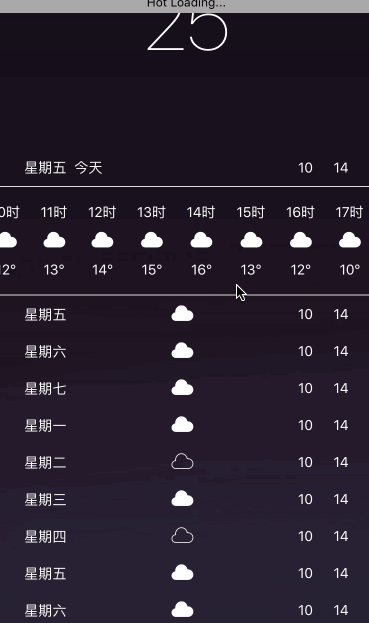
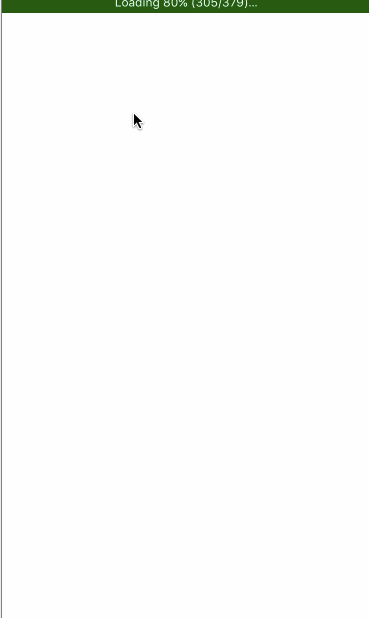
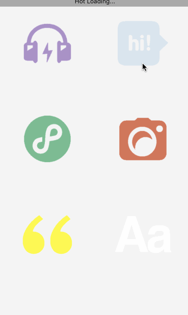
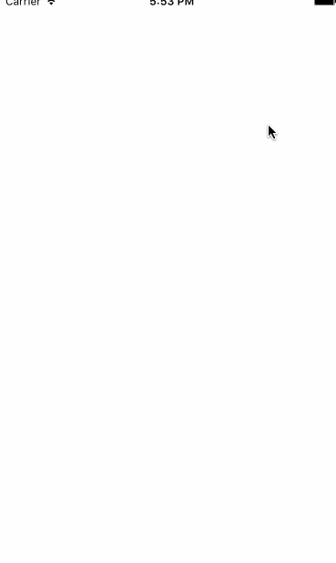

## days

days将[https://github.com/redsx/NAMI](https://github.com/redsx/NAMI)移动端所需的组件拆分成多个demo，一步一步实现，最终完成后将所有组件结合NAMI前后端，开发出一个完整的app

该项目灵感来自: [http://samvlu.com/](http://samvlu.com/)，[https://github.com/redsx/NAMI](https://github.com/redsx/NAMI)

#### demo 1
熟悉基础组件

#### demo 2
熟悉基础组件，使用Swiper

#### demo 3
熟悉动画组件

#### demo 4
实现查看图片组件

#### demo 5
消息列表

